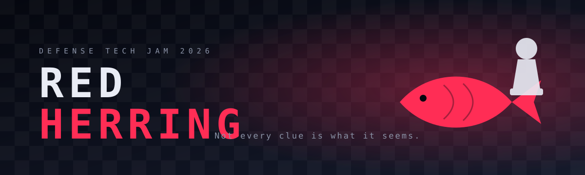
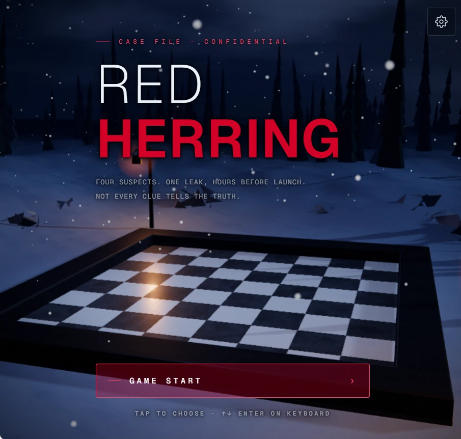
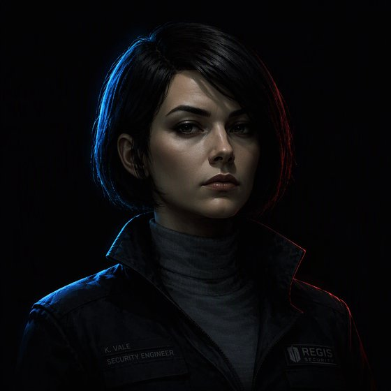
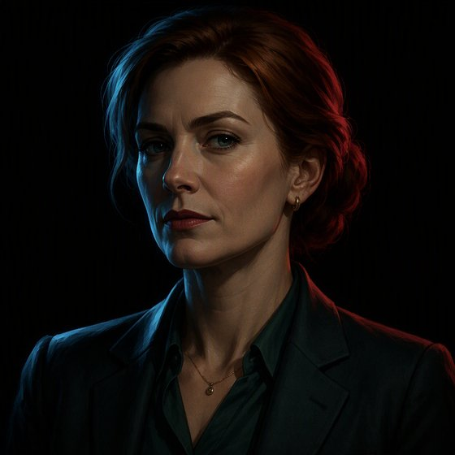

<div align="center">



### A chess-themed detective game that tests how fast and clearly you can think under pressure.

[](https://itch.io/jam/defense-tech-jam-26/rate/5032547)
[](https://itch.io/jam/defense-tech-jam-26)


</div>

<div align="center">

</div>

---

## 🕵️ The premise

It's **11:47 PM**, less than twelve hours before **Project Helix** — a confidential new AI model — is due to be unveiled. Then a private demo video appears online: unreleased capabilities, internal evaluations, and serious safety concerns.

The leak came from inside the building. Four people were still connected that night. The digital evidence points at one of them — *strongly*.

**You have five minutes to find out whether it's telling the truth.**

> *Some evidence looks damning but doesn't mean what it seems. Decide what to trust, place it under the right suspect, and star the pieces that matter most.*

## 👥 The suspects

<table>
  <tr>
    <td align="center" width="25%"><br><b>Ethan Cole</b><br><sub>Research Scientist</sub><br><sub>Built Helix's core model. Fought hardest over the safety findings.</sub></td>
    <td align="center" width="25%"><br><b>Avery Chen</b><br><sub>Security Engineer</sub><br><sub>Holds the keys to every log, badge reader and camera.</sub></td>
    <td align="center" width="25%"><br><b>Olivia Grant</b><br><sub>Product Manager</sub><br><sub>Owns tomorrow's launch. A leak could sink it — or supercharge it.</sub></td>
    <td align="center" width="25%"><br><b>Noah Reed</b><br><sub>Temporary Contractor</sub><br><sub>Two weeks into the job. The easiest person in the building to frame.</sub></td>
  </tr>
</table>

## 🎮 How to play

The evidence lives on a **chess board** — 32 squares, one piece of evidence each, rendered in a snowbound 3D forest clearing. Every piece of information costs time and attention, so choose carefully.

| Action | What it does |
| --- | --- |
| 🔍 **Dig In** | Reveal a deeper layer of a clue. The piece upgrades — pawn → knight → bishop → king — so you can see how far you've looked. |
| 🧺 **Add to Basket** | Hold a clue as potentially relevant. |
| 🗑️ **Discard** | Throw out a clue you think is fabricated. |
| ⭐ **Star** | Mark the evidence that best supports your theory. |
| 🎯 **Place** | Assign a clue to the suspect it really concerns. |
| ♟️ **Call Checkmate** | Submit your final theory before the clock runs out. |

At the end you answer five questions — who leaked the original video, who altered the second one, who was wrongly accused, whose security concerns were legitimate, and *why* the early evidence pointed the wrong way — and get a case report scoring your **outcome**, **evidence selection**, and **reasoning**.

> **Heads up:** the title is a hint. Some clues are genuine but misleading (*red herrings*); others are outright fabrications. They are not the same thing.

### Stories

| | Story | Status |
| --- | --- | --- |
| 1 | **The Leak** — Project Helix | ✅ Playable |
| 2 | **The Silent Clearing** | 🚧 Teaser only |
| 3 | **Blood on the Snow** | 🚧 Teaser only |

## ✨ What's under the hood

- **Fully procedural 3D** — pieces are lathe profiles, materials are stock three.js materials with GLSL grafted in (bone grain, obsidian fracture, wind-carved snow drifts), sky and aurora are shaders, and sound effects are synthesised on the fly.
- **Evidence as game state** — every clue carries `real`, `redHerring`, `aboutSuspect`, `relevance` and layered `digLevels`; deal order is scheduled so neighbouring squares never point at the same suspect.
- **Fair scoring** — precision and coverage are combined by harmonic mean, so one lucky guess can't earn half the score. Scoring lives in pure, tested functions.
- **A real chess engine** — 0x88 move generation, negamax + alpha-beta search in a Web Worker, inherited from the project's 3D chess origins.
- **Adaptive quality** — frame times are measured at startup and the renderer steps down a quality tier only if it needs to.
- **Zero build step** — plain ES modules, three.js vendored, no network needed at runtime.

More detail in [`docs/ARCHITECTURE.md`](docs/ARCHITECTURE.md).

## 🚀 Run it locally

```bash
git clone https://github.com/KianaShi/IsThatTrue.git
cd IsThatTrue
npm run dev        # serves http://localhost:5173
```

Any static server works (`python -m http.server`, etc.). Open `index.html` over HTTP — not `file://` — because the game uses ES modules and a Web Worker.

Settings (music, sounds, timer, graphics quality, snowfall) are available from the gear icon and remembered on the device. A GPU-accelerated browser is recommended.

### Tests

```bash
npm test
```

## 🗂️ Project layout

```
index.html        all screens + HUD markup
src/
  game/           cases, questions, scoring, evidence state, 3D board
  chess/          engine, AI, worker
  scene/ world/   renderer, lighting, post-processing, sky, snow, forest
  ui/             menus, HUD, case report, styles
tests/            scoring and game-flow tests
assets/           portraits, evidence photos, piece renders, audio/, video/
docs/             architecture notes and README images
```

## 🏆 Made for Defense Tech Jam 2026

Red Herring was built for [**Defense Tech Jam 2026**](https://itch.io/jam/defense-tech-jam-26) on itch.io. If you played it, a rating on the [jam page](https://itch.io/jam/defense-tech-jam-26/rate/5032547) means the world to us.

## 🙌 Team

- [**KianaShi**](https://github.com/KianaShi)
- [**leonardoTT-debug**](https://github.com/leonardoTT-debug)

---

<div align="center"><sub>Trust the evidence. Then check the evidence.</sub></div>
